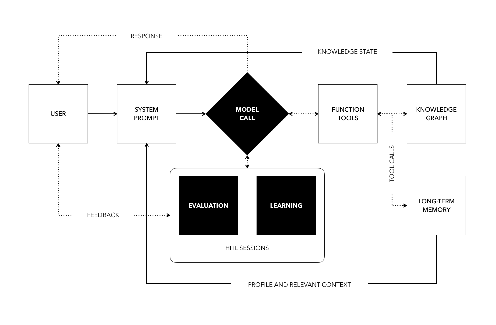
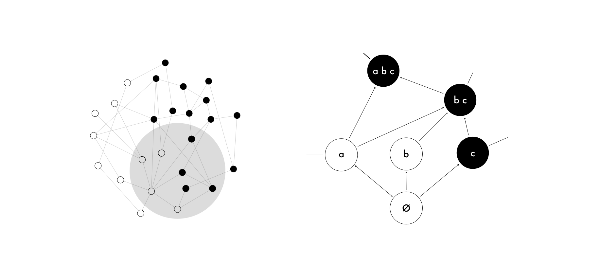
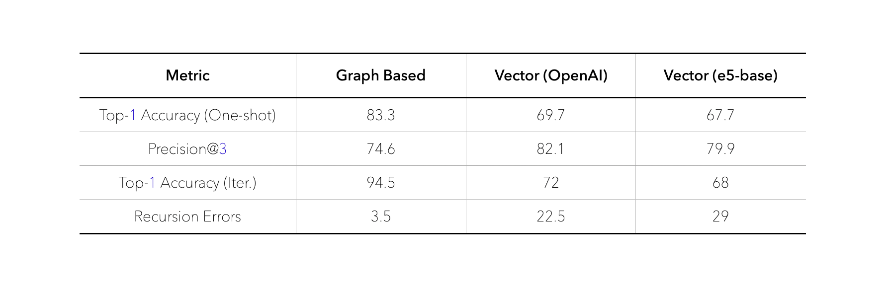

# AI Agents for Personalized Learning

## Overview

This repository contains the code and materials accompanying a master's thesis on a novel agent-based architecture that unites Large Language Models (LLMs) with a Knowledge Graph (KG).  

This thesis was completed as part of a Master's degree in Applied Mathematics and Computer Science at Moscow Institute of Physics and Technology (MIPT). 

The system functions as an intelligent educational assistant with several core capabilities:

- Dynamically tracks a learner's evolving knowledge state
- Traverses the Knowledge Graph to identify prerequisites, plan personalized explanations, and provide feedback
- Extracts and stores data in long-term memory enabling continuous adaptation
- Orchestrates two human-in-the-loop sub-agents for Learning and Evaluation Sessions


## Data Sources

The system's knowledge foundation is built from curated resources:

- [**Google's Machine Learning Glossary**](https://developers.google.com/machine-learning/glossary): A comprehensive glossary covering a broad range of machine learning terms
- [**Machine Learning Ontology (MLOnto)**](https://doi.org/10.17605/OSF.IO/CHU5Q): An ontology representing machine learning knowledge, developed by Braga, Regateiro, and Dias
- **Synthetic Data**: Automated pipeline generates structured JSON nodes (ID, title, prerequisites) which are then expert-curated for logical consistency

## Repository Structure

```
├── docs/               # Presentation materials
├── mcp/                # Model Context Protocol (Coming Soon)
├── prototype/          # System implementation
│   ├── backend/        # Server-side components
│   └── frontend/       # User interface elements
├── research/           # Experimental and analytical work
│   ├── data/           # Datasets and evaluation
│   └── notebooks/      # Analysis and experiment notebooks
├── .github/            # Project documentation assets
└── README.md           # Project overview
```


## System Architecture



**Fig. 1:** The high-level architecture integrates a Large Language Model, a Knowledge Graph, and a long-term memory component, alongside supportive modules such as retrieval functions and evaluation prompts. The agent's workflow involves:

1. **Input Processing:** Learner's query + system prompt (including profile data, history, KG state)
2. **Dynamic System Prompt:** Enriched with conversation history, relevant items from memory, user's knowledge state, and KG communities
3. **Orchestration:**  
   - **Retrieval Function Tools** (`retrieve_node`, `get_prerequisites`, `update_concept_status`)
   - **Memory Function Tools** (`store_memory`, `retrieve_memory`, `delete_memory`)
   - **Session Manager:** Learning and Evaluation modes with planning and execution phases

## Knowledge Graph



**Fig. 2:** The Knowledge Graph is organized according to Knowledge Space Theory, where nodes represent concepts and directed edges denote prerequisite relationships. This hierarchical structure ensures that learners master fundamental concepts before progressing to more advanced material. By mapping the learner's current knowledge state onto the graph, the system can select the most suitable next steps, ensuring pedagogically sound content delivery.

- **Nodes:** Atomic concepts (ID, title, section, content)
- **Edges:** Directed "prerequisite" relationships (per Knowledge Space Theory)

## Results

**Retrieval Method Comparison:** We evaluated retrieval methods over a 300-query benchmark:



**Figure 3:** Graph-based retrieval outperforms embedding-based approaches with 83.33% accuracy.

**Qualitative Review:** Expert raters scored the system highly across all evaluated dimensions with an overall average rating of approximately 2.8 out of 3 and a Cohen's κ of about 0.60, indicating moderate inter-rater agreement.

## Publications and Presentations

This research was presented at:
- **IEEE International Conference on Robotics, Intelligent Control and Artificial Intelligence** (China, 2024)

## Future Development

The methods and results from this research are being applied to develop `leias`, an advanced multi-agent educational assistant that expands upon the architecture presented here. As an active development project, new features and improvements are continuously being implemented.

## Acknowledgements

Thesis Supervisor: Olga Ataeva, Senior Researcher, Ph.D. in Technical Sciences, Federal Research Center of the Russian Academy of Sciences (FRC CSC RAS)

Thesis Reviewer: Natalia Tuchkova, Senior Researcher, Ph.D. in Physics and Mathematics, Head of the "Software Systems" Department, Federal Research Center "Computer Science and Control" of the Russian Academy of Sciences (FRC CSC RAS)